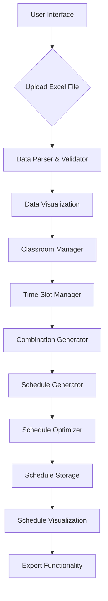

# Lecture Schedule Preparation System Design

## 1. Overview

The Lecture Schedule Preparation System is designed to automate the process of creating lecture schedules for the Faculty of Economics. The system will accept Excel file uploads containing lecture data and automatically generate optimized schedules based on various constraints and requirements.

The system will first extract and present the data for each professor, lecture, and other entities as described by the variables. It will then allow administrators to define available classrooms and time slots, and finally generate optimized schedules based on all these constraints.

### 1.1 Purpose
The system aims to:
- Automate the lecture scheduling process for the Faculty of Economics
- Reduce manual effort in creating conflict-free schedules
- Ensure optimal allocation of resources (classrooms, time slots, professors)
- Handle complex scheduling constraints and requirements

### 1.2 Scope
The system will:
- Accept Excel file uploads with lecture data
- Parse and validate the input data
- Generate optimized lecture schedules
- Support multiple departments, semesters, academic levels, and years
- Provide schedule visualization and export capabilities

## 2. Architecture



### 2.1 Components

1. **User Interface Layer**
   - File upload component
   - Data visualization dashboard
   - Classroom management interface
   - Time slot configuration interface
   - Schedule display and management interface
   - Export options

2. **Data Processing Layer**
   - Excel file parser
   - Data validation module
   - Data transformation service
   - Data presentation module

3. **Resource Management Layer**
   - Classroom manager
   - Time slot manager
   - Resource allocation module
   - Combination generator

4. **Business Logic Layer**
   - Schedule generation algorithm
   - Constraint checking module
   - Optimization engine

5. **Data Storage Layer**
   - Schedule database
   - Configuration storage
   - Historical data repository
   - Resource definition storage

6. **Export Layer**
   - PDF export functionality
   - Excel export functionality
   - Calendar integration

## 3. Data Models

### 3.1 Lecture Entity
| Field | Type | Description |
|-------|------|-------------|
| Lenda_e_rreg | String | Name of the lecture/course |
| Dep_reale_rreg | String | Department offering the lecture |
| Sem_rreg | String | Semester when the lecture is offered |
| Niveli_rreg | String | Academic level (Bachelor/Master) |
| Viti_rreg | String | Academic year |
| Prof_rreg | String | Professor teaching the lecture |
| Grup_rreg | String | Student group (e.g., Gr. 1, Gr. 2) |
| Status_lende_rreg | String | Lecture type (L = Lecture, U = Exercise) |
| Qasja_lende_rreg | String | Course requirement (O = Obligatory, Z = Elective) |
| Mesimdhe_lende_rreg | String | Instructor type (P = Professor, A = Teaching Assistant) |
| Time_per_lec_rreg | Integer | Length of lecture in minutes (45, 90, 135) |
| TimePreference | String | Preferred time slot (Morning, Midday, Evening) |
| RelatedLecture | String | Reference to related lecture (L->U relationship) |

### 3.2 Department Entity
| Field | Type | Description |
|-------|------|-------------|
| Code | String | Department code (AEM, EK, BF, MXH, Kon) |
| Name | String | Full department name |
| LectureCount | Integer | Number of lectures in department |
| PreferredTimeSlots | String | Preferred time slots for department |
| CohesionPriority | Integer | Priority for grouping lectures together |

### 3.3 Group Entity
| Field | Type | Description |
|-------|------|-------------|
| Id | String | Group identifier (e.g., Gr. 1, Gr. 2) |
| SubGroups | Array | List of subgroups (e.g., Gr. 1.1, Gr. 1.2) |
| LectureCount | Integer | Number of lectures for group |
| DailyLimit | Integer | Maximum lectures per day for group |

### 3.4 Subgroup Entity
| Field | Type | Description |
|-------|------|-------------|
| Id | String | Subgroup identifier (e.g., Gr. 1.1, Gr. 1.2) |
| ParentGroup | String | Parent group identifier |
| LectureCount | Integer | Number of lectures for subgroup |
| DailyLimit | Integer | Maximum lectures per day for subgroup |

### 3.5 Schedule Entity
| Field | Type | Description |
|-------|------|-------------|
| LectureId | String | Reference to lecture |
| TimeSlot | DateTime | Scheduled time |
| Classroom | String | Assigned classroom |
| Professor | String | Assigned professor |

### 3.5 Classroom Entity
| Field | Type | Description |
|-------|------|-------------|
| Id | String | Unique identifier (e.g., S1, S2, S3) |
| Name | String | Classroom name |
| Capacity | Integer | Number of students that can be accommodated |
| Equipment | String | Special equipment available |
| Status | String | Available/Unavailable |

### 3.6 Time Slot Entity
| Field | Type | Description |
|-------|------|-------------|
| Id | String | Unique identifier |
| Day | String | Day of the week (Monday-Friday) |
| StartTime | Time | Start time (e.g., 09:00) |
| EndTime | Time | End time (e.g., 17:00) |
| Duration | Integer | Duration in minutes |
| Status | String | Available/Unavailable |

### 3.7 Time Slot Configuration
| Field | Type | Description |
|-------|------|-------------|
| MinimumSlot | Integer | Minimum time slot (45 minutes) |
| StandardSlot | Integer | Standard time slot (90 minutes) |
| ExtendedSlot | Integer | Extended time slot (135 minutes) |
| WorkingHoursStart | Time | Start of working hours (09:00) |
| WorkingHoursEnd | Time | End of working hours (17:00) |
| MorningStart | Time | Start of morning period (09:00) |
| MorningEnd | Time | End of morning period (11:00) |
| MiddayStart | Time | Start of midday period (11:00) |
| MiddayEnd | Time | End of midday period (15:00) |
| EveningStart | Time | Start of evening period (15:00) |
| EveningEnd | Time | End of evening period (17:00) |

## 4. Excel Data Format

The system expects Excel files with the following column structure:

| Column Name | Description | Example Values |
|-------------|-------------|----------------|
| Lenda_e_rreg | Lecture name | Mikroekonomia, Matematika për ekonomistë |
| Dep_reale_rreg | Department | MK, MXH, EK, Kon, BF |
| Sem_rreg | Semester | Semestri i parë (I), Semestri i tretë (III) |
| Niveli_rreg | Academic level | Baçelor, Master |
| Viti_rreg | Academic year | VITI I, VITI II |
| Prof_rreg | Professor | Ramiz Livoreka, Ajet Ahmeti |
| Grup_rreg | Student group | Gr. 1, Gr. 2, Gr. 1.1, Gr. 1.2 |
| Status_lende_rreg | Lecture type | L (Lecture), U (Exercise) |
| Qasja_lende_rreg | Course requirement | O (Obligatory), Z (Elective) |
| Mesimdhe_lende_rreg | Instructor type | P (Professor), A (Teaching Assistant) |
| Time_per_lec_rreg | Lecture length | 45, 90, 135 |

## 5. Business Logic

### 5.1 Data Validation Rules
- All required fields must be present
- Department codes must match predefined values (AEM, EK, BF, MXH, Kon)
- Semester values must be valid
- Academic levels must be either "Bachelor" or "Master"
- Academic years must be either "VITI I" or "VITI II"
- Professor names must not be empty
- Student groups must follow the specified format (Gr. 1, Gr. 2, etc. with subgroups)
- Lecture type must be either "L" (Lecture) or "U" (Exercise)
- Course requirement must be either "O" (Obligatory) or "Z" (Elective)
- Instructor type must be either "P" (Professor) or "A" (Teaching Assistant)
- Lecture length must be either 45, 90, or 135 minutes
- Each lecture must have a unique combination of department, semester, and group when scheduled

### 5.2 Data Presentation
After parsing the Excel data, the system will present:
- List of all professors and their assigned lectures
- List of all lectures with their details
- Summary by department, semester, academic level, and year
- Student group hierarchies and their lecture assignments
- Lecture type distribution (lectures vs. exercises)
- Course requirement distribution (obligatory vs. elective)
- Instructor type distribution (professors vs. teaching assistants)
- Departmental lecture counts and cohesion analysis
- Group and subgroup lecture distribution
- Daily lecture load analysis per department and group
- Lecture-exercise relationship mapping
- Time preference analysis (morning/midday/evening distribution)
- Related lecture pairings (L->U relationships)

### 5.3 Classroom Management
- Add/remove classrooms manually
- Define classroom properties (name, capacity, equipment)
- Set classroom availability
- Assign classrooms to departments (preferences)
- View classroom utilization reports

### 5.4 Time Slot Management
- Define working hours (Monday to Friday, 09:00 to 17:00)
- Create custom time slots
- Set time slot availability
- Assign preferred time slots to departments
- View time slot utilization

### 5.5 Schedule Generation Algorithm
1. Parse and validate uploaded Excel data
2. Present parsed data for review
3. Manage classroom resources
4. Configure time slots
5. Generate all possible lecture combinations:
   - Create combinations of lectures, classrooms, days, and time slots
   - Apply constraint checking to filter valid combinations
   - Consider professor availability
   - Consider student group availability
   - Ensure classroom capacity requirements are met
   - Ensure lecture durations fit within available time slots
6. Apply constraint satisfaction algorithm:
   - No classroom can host two lectures at the same time
   - No professor can teach two lectures at the same time
   - No student group can attend two lectures simultaneously (same department/semester/group)
   - Lectures and exercises of the same course should be scheduled appropriately
   - Exercises (U) should be scheduled after corresponding lectures (L) with the same name
   - No time slot can be overbooked
   - Lectures in the same semester should be scheduled appropriately
   - Lectures from the same department should be grouped together when possible
   - Lectures should be distributed evenly across weekdays
   - No more than a defined number of lectures per day per department
   - No more than a defined number of lectures per day per group/subgroup
   - Balance workload across time slots and classrooms
   - Ensure lecture durations are properly accommodated
7. Optimize schedule for:
   - Minimal conflicts
   - Efficient resource utilization
   - Logical grouping of related lectures
   - Appropriate separation of student subgroups
   - Efficient allocation based on instructor type
   - Optimal classroom usage
   - Departmental cohesion (lectures from same department grouped together)
   - Balanced daily lecture distribution (avoid overloading any single day)
   - Even distribution across departments
   - Even distribution across student groups
   - Professor workload balancing
   - Classroom utilization optimization
   - Preferred ordering of lectures and exercises
   - Optimal placement of elective vs. obligatory courses
   - Preferred ordering of lectures and exercises
   - Optimal placement of elective vs. obligatory courses

### 5.6 Combination Generation
- Generate all possible combinations of lectures with available classrooms, days, and time slots
- Apply filtering based on constraints to create valid combinations only
- Ensure lecture durations fit within available time slots
- Prioritize time slots based on course requirements (Z=beginning/end, O=midday)
- Create lecture-exercise pairing combinations
- Create a matrix of possible scheduling options
- Calculate combination scores based on optimization criteria

### 5.7 Scheduling Constraints
- No two lectures can be in the same classroom at the same time
- No two lectures can be held by the same professor at the same time
- No two lectures can be attended by the same students at the same time (same department, semester, group, and subgroup)
- Lectures from the same department should be grouped together (cohesion)
- Lectures should be distributed evenly across weekdays
- Maximum number of lectures per day per department (e.g., no more than 4)
- Maximum number of lectures per day per group/subgroup (e.g., no more than 3)
- Exercises (U) must be scheduled after corresponding lectures (L) with the same name
- Elective courses (Z) should be scheduled at the beginning and end of the day
- Obligatory courses (O) should be scheduled in the middle of the day

### 5.8 Scheduling Preferences
- Lectures (L) should be scheduled before corresponding exercises (U) with the same name
- Elective courses (Z) preferred at the beginning (09:00-11:00) and end of the day (15:00-17:00)
- Obligatory courses (O) preferred in the middle of the day (11:00-15:00)
- Related lectures and exercises should be scheduled on the same or consecutive days
- Elective courses should be distributed evenly throughout the week

### 5.9 Conflict Detection
- Professor scheduling conflicts
- Classroom allocation conflicts
- Time slot overbooking
- Departmental scheduling conflicts
- Student group scheduling conflicts
- Lecture/exercise scheduling conflicts
- Instructor type allocation conflicts
- Resource availability conflicts
- Lecture duration conflicts
- Time slot fragmentation conflicts
- Departmental cohesion conflicts
- Daily lecture distribution conflicts
- Group/subgroup scheduling conflicts
- Student attendance conflicts (same department/semester/group)
- Lecture relationship conflicts (exercises before lectures)
- Time preference conflicts (elective/obligatory placement)

## 6. User Interface

### 6.1 Upload Interface
- File selection component
- Format validation feedback
- Upload progress indicator
- Success/error notifications

### 6.2 Data Presentation Interface
- Dashboard showing parsed data
- Filterable views by professor, department, semester
- Departmental cohesion analysis view
- Group and subgroup distribution views
- Daily load analysis charts
- Lecture-exercise relationship views
- Time preference analysis charts
- Summary statistics
- Data validation reports

### 6.3 Classroom Management Interface
- List of available classrooms
- Add/remove classroom functionality
- Edit classroom properties
- Set classroom availability
- Classroom utilization visualization

### 6.4 Time Slot Management Interface
- Weekly time slot grid (Monday-Friday, 09:00-17:00)
- Add/remove time slots
- Set time slot availability
- Configure time slot durations (45, 90, 135 minutes)
- Time slot utilization visualization

### 6.5 Combination Presentation
- Grid view showing all possible lecture combinations
- Filtering by lecture, professor, department, classroom, day, and time slot
- Combination scoring visualization
- Conflict highlighting

### 6.6 Schedule Display
- Weekly calendar view
- Departmental filtering
- Professor filtering
- Semester filtering
- Classroom filtering
- Time slot filtering
- Group/subgroup filtering
- Daily load balancing view
- Departmental cohesion view
- Lecture-exercise relationship view
- Time preference filtering (morning/midday/evening)
- Export options

## 7. API Endpoints

### 7.1 File Upload
```
POST /api/schedule/upload
Content-Type: multipart/form-data
```
- Request: Excel file
- Response: Parsed data with validation results

### 7.2 Data Presentation
```
GET /api/data/presentation
```
- Response: Formatted data presentation

### 7.3 Classroom Management
```
GET /api/classrooms
POST /api/classrooms
PUT /api/classrooms/{id}
DELETE /api/classrooms/{id}
```
- Request/Response: Classroom data

### 7.4 Time Slot Management
```
GET /api/timeslots
POST /api/timeslots
PUT /api/timeslots/{id}
DELETE /api/timeslots/{id}
```
- Request/Response: Time slot data

### 7.5 Combination Generation
```
POST /api/combinations/generate
Content-Type: application/json
```
- Request: Configuration parameters including classroom and time slot constraints
- Response: All possible lecture combinations with scores

### 7.6 Schedule Generation
```
POST /api/schedule/generate
Content-Type: application/json
```
- Request: Configuration parameters including classroom and time slot constraints
- Response: Generated schedule

### 7.7 Schedule Retrieval
```
GET /api/schedule/{id}
```
- Response: Schedule data in JSON format

### 7.8 Schedule Export
```
GET /api/schedule/{id}/export
```
- Response: Schedule in requested format (PDF, Excel)

## 8. Implementation Considerations

### 8.1 Technology Stack
- Backend: Node.js with Express or Python with Flask
- Frontend: React or Vue.js
- Database: PostgreSQL or MongoDB
- File Processing: SheetJS or Apache POI
- Scheduling Algorithm: Custom constraint satisfaction implementation
- Resource Management: Custom resource allocation algorithms
- Combination Generation: Combinatorial optimization algorithms
- Time Management: Custom time slot allocation algorithms
- Departmental Cohesion: Custom grouping algorithms
- Load Balancing: Custom distribution algorithms
- Preference Optimization: Custom preference-based scheduling algorithms
- Relationship Mapping: Custom lecture-exercise pairing algorithms
- Conflict Detection: Custom multi-dimensional conflict detection algorithms

### 8.2 Performance Requirements
- Excel files with up to 1000 lectures should process within 30 seconds
- Combination generation for up to 1000 lectures should complete within 2 minutes
- Schedule generation should complete within 1 minute for typical datasets
- System should support concurrent users
- Resource management operations should respond within 2 seconds
- Time slot duration processing should accommodate variable lecture lengths (45/90/135 min)

### 8.3 Security Considerations
- File type validation to prevent malicious uploads
- Input sanitization to prevent injection attacks
- Role-based access control for schedule management
- Access control for resource management functionality

## 9. Testing Strategy

### 9.1 Unit Tests
- Excel parsing functionality
- Data validation rules
- Data presentation module
- Classroom management functionality
- Time slot management functionality
- Combination generation algorithm
- Schedule generation algorithm
- Conflict detection logic
- Lecture duration validation
- Time slot duration accommodation
- Departmental cohesion algorithms
- Group/subgroup conflict detection
- Daily load distribution validation
- Lecture-exercise relationship validation
- Time preference placement validation
- Course requirement scheduling validation
- Classroom conflict detection
- Professor conflict detection
- Student attendance conflict detection

### 9.2 Integration Tests
- End-to-end file upload and schedule generation
- Resource management workflows
- API endpoint testing
- Database integration

### 9.3 Performance Tests
- Large file processing
- Concurrent user scenarios
- Schedule optimization efficiency
- Resource management performance
- Time slot allocation performance
- Combination generation performance
- Large-scale combination filtering

## 10. Future Enhancements

### 10.1 Advanced Features
- Classroom assignment optimization
- Student enrollment integration
- Automatic conflict resolution suggestions
- Schedule change tracking and history
- Student subgroup management
- Lecture/exercise pairing optimization
- Instructor type allocation optimization
- Automated classroom scheduling based on capacity requirements
- Intelligent time slot recommendations
- Resource utilization forecasting
- Intelligent combination filtering based on historical data
- Machine learning-based combination scoring
- Parallel processing for large combination sets
- Dynamic time slot creation based on lecture durations
- Intelligent lecture duration recommendations
- Advanced departmental cohesion algorithms
- Intelligent group/subgroup load balancing
- Predictive scheduling based on historical patterns
- Intelligent preference-based scheduling optimization
- Automated lecture-exercise relationship enforcement
- Adaptive time preference learning based on usage patterns
- Advanced conflict prediction and prevention
- Real-time conflict resolution suggestions
- Intelligent student attendance conflict avoidance

### 10.2 Reporting
- Professor workload reports
- Departmental scheduling reports
- Resource utilization analytics
- Student group scheduling reports
- Lecture/exercise distribution reports
- Instructor type allocation reports
- Classroom utilization reports
- Time slot occupancy reports
